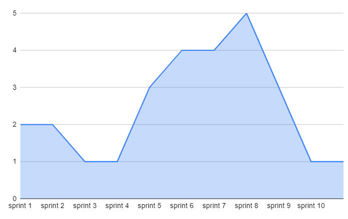

# Documento de riscos

| Data       | Versão | Descrição                                           | Autor              |
| ---------- | ------ | --------------------------------------------------- | ------------------ |
| 22/05/2021 | 0.1    | Adicionado documento               | Helena Bretas |

## Introdução 

O mapeamento de riscos do projeto é importante para prever acontecimentos que possam impedir a entrega do projeto. Mais do que o mapeamento, o gerenciamento dos riscos também torna-se essencial, para que os empecilhos possam ser resolvidos o quanto antes.

## Mapeamento de riscos

Como a equipe de gerência já passou anteriormente pela disciplina Métodos de Desenvolvimento de Software, alguns pontos de risco foram mapeados antes do produto começar a ser desenvolvido dada a experiência anterior de cada gerente, e foi estabelecido o período de análise de duas sprints (duas semanas) de desenvolvimento para avaliar os demais riscos a serem mapeados no projeto.

## Riscos mapeados pela equipe de gerência

| Risco       | Ação Preventitva | Ação reativa          
| ---------- | ------ | --------------------------------------------------- |
| MDS não entenderem a importância da disciplina e não conseguirem acompanhar o ritmo | Conscientização a respeito do funcionamento da disciplina e alinhamento de expectativas  | Solicitar a intervenção do professor em casos extremos       |  
Falta de conhecimento prévio dos MDS | Dojos e treinamentos | Intervenção dos gerentes nas tasks |
Produto não ser finalizado dentro do cronograma | Retrospectivas semanais com a equipe com acompanhamento das issues | Intervenção dos gerentes nas tasks |
Má configuração do projeto (ci e deploy contínuo) | Ação ser realizada em dupla, para que ocorra um double check das ações | Intervenção de outros colegas na configuração

## Riscos mapeados após duas sprints de desenvolvimento

| Risco       | Ação Preventitva | Ação reativa          
| ---------- | ------ | --------------------------------------------------- |
EPS falhar em pontos de gerência pela comunicação com o professor | Marcar reuniões constantes para alinhar as dúvidas com o professor | Agir após o professor chamar atenção para possíveis falhas
Divergência de horários entre os membros |Quadro de planilha de horas de cada um | Mudar duplas de pareamento no decorrer das sprints

## Métricas

Este ponto é essencial, pois vai além do mapeamento dos riscos: ele discute a possibilidade de acontecer e metrifica, em escala de 0 a 5, o quanto isso pode impactar no projeto.

| Probabilidade      | Descrição | Nível do dano          
| ---------- | ------ | --------------------------------------------------- |
Baixa | Baixo impacto | 1
Média | Médio impacto | 2-3 
Alta | Alto impacto | 4-5

## Mapeamento de riscos por sprint

O gráfico abaixo demonstra os riscos que a equipe apresentou que poderiam acontecer, ou que até mesmo de fato aconteceram, durante cada sprint. Uma leitura interessante desse gráfico mostra: no início do projeto, a equipe como um todo teve medo de que não conseguiriam entregar tudo que o escopo da disciplina demanda. No decorrer das sprints, o risco de não entregar o projeto aumentou de acordo com que as tasks não foram entregues. Por final, os riscos foram diminuindo, dado que em dado momento as dívidas técnicas diminuíram também e o produto se mostrou pronto para ser entregue.

