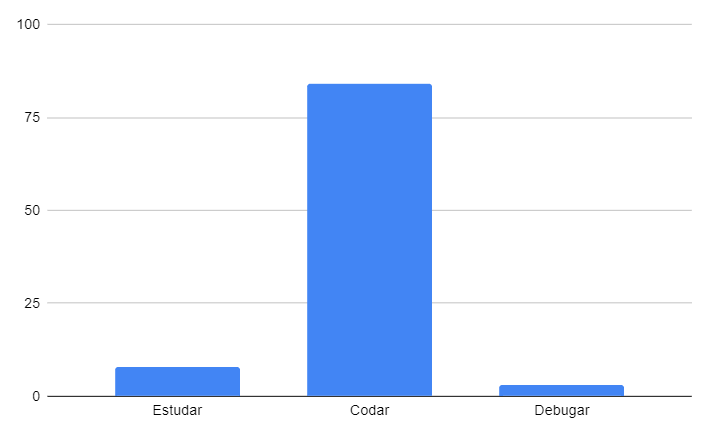

## Restrospectiva sprint 10

### De 09/05 a 15/05

| Data       | Versão | Descrição                                           | Autor              |
| ---------- | ------ | --------------------------------------------------- | ------------------ |
| 21/05/2021 | 1.0    | Transferindo do drive para o gh-pages               |    Helena Bretas   |

## Quantidade de horas gastas pelos MDS na sprint
Esta métrica é coletada com a intenção de entendermos onde os desenvolvedores estão gastando mais tempo na disciplina afim de ajudá-los. A quantidade de horas gastas por eles é preenchida em uma planilha do drive, que pode ser encontrada [aqui](https://drive.google.com/drive/folders/1qbKIsqlnY7s33jziuN4mZ-z4Dm_bJ7nM?usp=sharing). O gráfico abaixo mostra o resultado final em quantas horas foram gastas para estudar, codar e debugar o código feito.

- Estudar: 8h
- Codar: 84h
- Debugar: 3h

### O que aconteceu?

Nesta sprint os gerentes precisaram de uma conversa mais séria com os MDS. Mesmo com a sprint #8 voltada somente para resolução de dívidas técnicas, algumas issues de dívidas continuaram não sendo entregues e por conta disso, optamos por não fazer as issues programadas para a última semana do projeto, dado que havia um atraso significativo acontecendo.

A chance neste momento era do projeto não ser entregue: os MDS estavam muito dependentes de EPS para resolução de conflitos internos e também para a conclusão de tasks. 

A reunião foi voltada para uma conversa aberta, onde todos poderiam dizer o que estava acontecendo para não conseguirem entregar as atividades no período programado, e os alunos Lyra e Cibele se destacaram como desenvolvedores mais atuantes nas últimas semanas. 

Os problemas foram mapeados conforme o quadro a seguir:

| Autor       | Problema | Como resolver?         | 
| ---------- | ------ | --------------------------------------------------- |
| Cristian | Está com problemas em interpretar qual sua dificuldade técnica em entregar a issue de dívida que ele possui.  | Helena e Albino finalizarão a atividade.               |    
| Rafael | Não possui conhecimentos técnicos o suficiente para finalizar a issue de dívida técnica | Helena e Albino finalizarão a atividade.
| Duda   |  As dívidas técnicas viraram bolas de neve e está difícil conciliar as demais matérias da UnB com issues novas e antigas   | Helena e Albino finalizarão a atividade.

## Quadro geral

|US|Pontos estimados pela equipe|Pontuação entregue|Rastreamento|
|-|-|-|-|
|US33|0 (dívida técnica) |5|[frontend #45](https://github.com/parlamentaqui/frontend/issues/45)|
|US10|0 (dívida técnica) |5|[frontend #59](https://github.com/parlamentaqui/frontend/issues/59)|
|US20|0 (dívida técnica) |8|[frontend #72](https://github.com/parlamentaqui/frontend/issues/72)|
|US27| 8|8|[frontend #87](https://github.com/parlamentaqui/frontend/issues/87)|
|US28| 8|8|[frontend #84](https://github.com/parlamentaqui/frontend/issues/84)|
|US57|8|8|[frontend #85](https://github.com/parlamentaqui/frontend/issues/85)|
|US58|5|5|[frontend #86](https://github.com/parlamentaqui/frontend/issues/86)|
| Total | 29 |47 |

