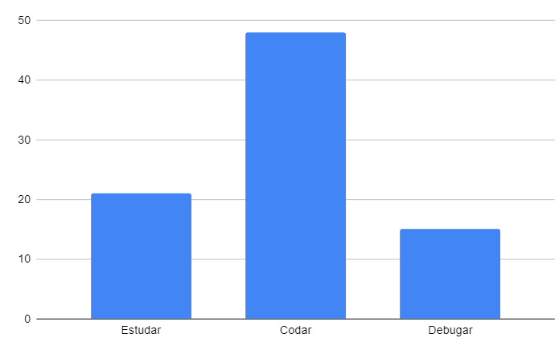

## Restrospectiva sprint 3

### De 21/03 a 27/03

| Data       | Versão | Descrição                                           | Autor              |
| ---------- | ------ | --------------------------------------------------- | ------------------ |
| 20/03/2021 | 1.0    | Criação do documento                                |     Gabriel Albino   Helena  |

## Quantidade de horas gastas pelos MDS na sprint
Esta métrica é coletada com a intenção de entendermos onde os desenvolvedores estão gastando mais tempo na disciplina afim de ajudá-los. A quantidade de horas gastas por eles é preenchida em uma planilha do drive, que pode ser encontrada [aqui](https://drive.google.com/drive/folders/1qbKIsqlnY7s33jziuN4mZ-z4Dm_bJ7nM?usp=sharing). O gráfico abaixo mostra o resultado final em quantas horas foram gastas para estudar, codar e debugar o código feito.

- Estudar: 21h
- Codar: 48h
- Debugar: 15h

## Action points solicitados para essa semana

| **Action Points** | **Responsáveis** | **Foi resolvido?** |
| ------------- | ------------ | ------------ | 
| Ver o "verify" no github (contribuição nos commits) | EPS |
| Perguntar para os colegas, interagir mais com a equipe quando houverem dúvidas | Todos |
| Dojo de docker | Fepas |
| [2 pontos anteriores auxiliam MDS] Rever lista de prioridades  | EPS |
| Não há | - |
| Fazer correções no documento e validar com o professor | EPS |
| Iniciar mais cedo na próxima semana | EPS |
| Marcar um papo para explicar figma, componentes do front, etc Ajudar os colegas de MDS | Albino Cibele |
| Montar o backlog | Albino e Helena |
| EPS ficarem a postos para ajudar no horário da aula | EPS |
| Ler material disponbilizado pelo professor | MDS |

## Retrospectiva

| **Pontos fracos** | **Pontos fortes** |
| ------------- | ------------- |
| Machado ficou com poucas tarefas destinadas a ele | Nosso projeto evoluiu bastante essa semana |
| Não foi feito tudo que foi combinado na ultima reunião. ex: Template de PR, padronização de componentes transversais | A divisão do time ficou boa |
| Algumas dependencias para iniciar as issues não foram feitas | MDS estão se ajudando bastante [e lyra god] |
| A descrição das issues estavam incompletas | Lyra se virou montando os ambientes |
| Organização do contribution > Falta de template de PR no github | MDS's gostaram da parte que ficaram de codar |
| Fepas ta numa viagem e não ta podendo ajudar muito | Menos dependecia de EPS |
| Lyra ficou com muitas tarefas & gastou muito tempo ajudando a galera |  |
| Tempo de resposta está muito alto e faltando proatividade para responder o professor |  |
| Duda não avisou que ia faltar a reunião |  |

## Action points solicitados para próxima semana

| **Action Points** | **Responsáveis** |
| ----------------- | ---------------- |
| Distribuição de tarefas pros EPS tem que ser discutido melhor | EPS |
| Criar lista de pendencias com responsáveis | EPS |
| Criar lista de pendencias com responsáveis | EPS |
| Melhorar a descrição das issues. + Adicionar print do protótipo + Adicionar micro-serviçõs utilizados + Adicionar JSON de retorno  | Albino |
| criar template de PR | Albino |
| Responder o professor na hora que ele mandar msg | EPS |
| Melhorar comunicação do time | Duda |

## Quadro geral

| US    | Pontuação estimada pela equipe | Pontuação entregue              | 
|-------|--------------------------------|---------------------------------|
| US40  | Dívida técnica                 | 0 - dívida técnica não entregue | 
| US1   | 5   |[issue #1](https://github.com/parlamentaqui/gateway/issues/1) |
| US2   | 5   |[issue #2](https://github.com/parlamentaqui/gateway/issues/1) |
| US9   | 5   |[issue #9](https://github.com/parlamentaqui/gateway/issues/9) |
| US3   | 5   |[issue #3](https://github.com/parlamentaqui/gateway/issues/3) |
| US38  | 13  |[issue #38](https://github.com/parlamentaqui/frontend/issues/38) |
| US37  | 8   |[issue #37](https://github.com/parlamentaqui/frontend/issues/37) |
| US39  | 13  |[issue #39](https://github.com/parlamentaqui/frontend/issues/39) |
| Total | 54  | |

