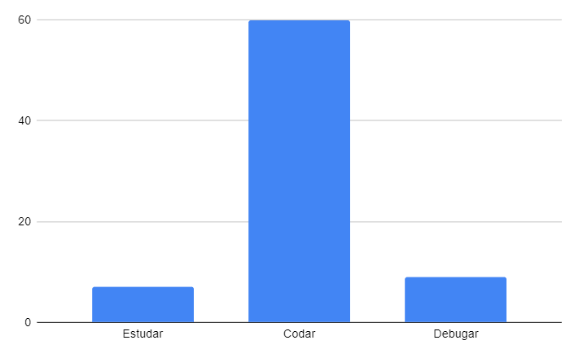

## Restrospectiva sprint 4

### De 28/03 a 03/04

| Data       | Versão | Descrição                                           | Autor              |
| ---------- | ------ | --------------------------------------------------- | ------------------ |
| 21/05/2021 | 1.0    | Transferindo do drive para o gh-pages               |    Helena   Lucas Machado   |

## Quantidade de horas gastas pelos MDS na sprint
Esta métrica é coletada com a intenção de entendermos onde os desenvolvedores estão gastando mais tempo na disciplina afim de ajudá-los. A quantidade de horas gastas por eles é preenchida em uma planilha do drive, que pode ser encontrada [aqui](https://drive.google.com/drive/folders/1qbKIsqlnY7s33jziuN4mZ-z4Dm_bJ7nM?usp=sharing). O gráfico abaixo mostra o resultado final em quantas horas foram gastas para estudar, codar e debugar o código feito.

- Estudar: 4h
- Codar: 60h
- Debugar: 9h

## Action points solicitados para essa semana

| **Action Points** | **Responsáveis** | **Foi resolvido?** |
| ------------- | ------------ | ------------ | 
| Distribuição de tarefas pros EPS tem que ser discutido melhor | Helena, Albino, Machado e Fepas | Não |
| Criar lista de pendencias com responsáveis | Helena, Albino, Machado e Fepas | Parcialmente |
| Melhorar comunicação do time | Todos | Sim |
| Melhorar a descrição das issues. + Adicionar print do protótipo + Adicionar micro-serviçõs utilizados + Adicionar JSON de retorno  | Albino | Sim |
| Criar template de PR | Albino | Sim |
| Responder o professor na hora que ele mandar mensagem | Todos | Sim |

## Retrospectiva

| **Pontos fracos** | **Pontos fortes** |
| ------------- | ------------- |
| Divergências de informações para as entregas da disciplina  | A gente não se odeia [ainda] (Todos concordam) |
| Dificuldade na comunicação para entrega da R1 (Helena) | Entregamos a R1! YAY!!! (Todos) |
| Reviews estão demorando para serem feitos (Albino) | Trabalhamos muito na última sprint (Todos) |
| Documentação deixou Helena e Machado menos focados em código até a entrega da R1 (Helena)  | As calls são produtivas e divertidas (Todos) |
| Atualização do Kanban está em falta (Albino) | Temos um domínio na internet e o projeto pode ser visto através dele (Todos) |
| Envio de dailies está aquém, o grupo precisa se comprometer mais (Helena) | Albino ajudou muito os MDS nos últimos tempos (Mari, Cibele) |
| Dificuldade em entender algumas issues e encontrar pré-requisitos delas [como as keys do twitter] (Cristian e Lyra) |  |
| Faltaram itens do back para entregar algumas issues (Cibele) |  |
| Deram o merge em uma atividade sem o PR dela (Cristian) |  |
| Dívidas técnicas estão tomando muito tempo de vida (Helena) |  |
| Falta de métricas das retrospectivas (Helena) |  |
| Algumas duplas de pareamento não estão funcionando entre si (Mari) |  |
| Dificuldade em entender quais são as dívidas técnicas (Cibele) |  |
| MDS poderiam ter ajudado no lugar no Albino (Albino) |  |

## Action points solicitados para próxima semana

| **Action Points** | **Responsáveis** |
| ----------------- | ---------------- |
| Não há |  |
| Tirar mais dúvidas, melhorar pró-atividade | Todos |
| Todos os EPS fazerem reviews | Helena, Albino, Machado e Fepas |
| Após a entrega da R1, os documentos diminuem, então poderão ajudar mais nos reviews | Helena, Machado |
| Equipe se comprometer em manter o quadro de atividades atualizado | Todos |
| Equipe se comprometer em respeitar a metodologia  | Todos |
| Merjar as coisas que auxiliarão nisso | Albino |
| Não merjar as tasks que não estão em review | Helena, Albino, Machado e Fepas |
| Criar tag de dívida técnica | Helena |
| Criar métricas na mão | Helena |
| Conduzir melhor as duplas de pareamento | Helena, Albino, Machado e Fepas |
| Manter o quadro kanban atualizado  | Todos |
| MDS compreenderem melhor as tasks e lerem com mais calma  | Mari, Duda, Cibele, Rafa, Lyra e Cristian |

## Quadro geral

| US    | Pontuação estimada pela equipe | Pontuação entregue              | 
|-------|--------------------------------|---------------------------------|
| US5   |5 |[issue #5](https://github.com/parlamentaqui/gateway/issues/5) |
| US34  |8 |[issue #34](https://github.com/parlamentaqui/frontend/issues/34)|
| US11  |8 |[issue #8](https://github.com/parlamentaqui/gateway/issues/8) |
| US15  |5 |[issue #15](https://github.com/parlamentaqui/gateway/issues/15) |
| US55  |5 |[issue #55](https://github.com/parlamentaqui/frontend/issues/55)|
| Total |31  | |

