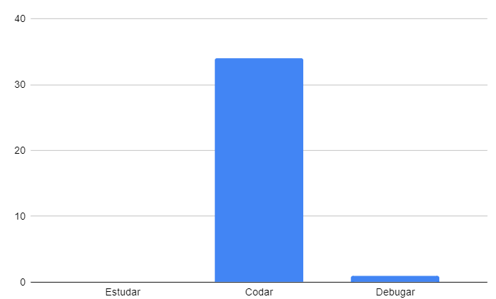

## Restrospectiva sprint 5

### De 04/04 a 10/04

| Data       | Versão | Descrição                                           | Autor              |
| ---------- | ------ | --------------------------------------------------- | ------------------ |
| 21/05/2021 | 1.0    | Transferindo do drive para o gh-pages               |    Helena   Lucas Machado   |

## Quantidade de horas gastas pelos MDS na sprint
Esta métrica é coletada com a intenção de entendermos onde os desenvolvedores estão gastando mais tempo na disciplina afim de ajudá-los. A quantidade de horas gastas por eles é preenchida em uma planilha do drive, que pode ser encontrada [aqui](https://drive.google.com/drive/folders/1qbKIsqlnY7s33jziuN4mZ-z4Dm_bJ7nM?usp=sharing). O gráfico abaixo mostra o resultado final em quantas horas foram gastas para estudar, codar e debugar o código feito.

- Estudar: 0h
- Codar: 34h
- Debugar: 1h

## Action points solicitados para essa semana

| **Action Points** | **Responsáveis** | **Foi resolvido?** |
| ------------- | ------------ | ------------ | 
| Melhora planejamento de entrega da R2  | Helena | Não |
| Tirar mais dúvidas, melhorar pró-atividade | Todos | Sim |
| Todos os EPS fazerem reviews | Helena, Albino, Machado e Fepas | Parcialmente |
| Após a entrega da R1, os documentos diminuem, então poderão ajudar mais nos reviews | Helena, Machado | Parcialmente |
| Equipe se comprometer em manter o quadro de atividades atualizado | Todos | Parcialmente |
| Equipe se comprometer em respeitar a metodologia  | Todos | Parcialmente |
| Merjar as coisas que auxiliarão nisso | Albino | Parcialmente |
| Não merjar as tasks que não estão em review | Helena, Albino, Machado e Fepas | Sim |
| Criar tag de dívida técnica | Helena | Parcialmente |
| Criar métricas na mão | Helena | Parcialmente |
| Conduzir melhor as duplas de pareamento | Helena, Albino, Machado e Fepas | Parcialmente |
| Manter o quadro kanban atualizado  | Todos | Parcialmente |
| MDS compreenderem melhor as tasks e lerem com mais calma  | Mari, Duda, Cibele, Rafa, Lyra e Cristian | Sim |

## Retrospectiva

| **Pontos fracos** | **Pontos fortes** |
| ------------- | ------------- |
| Bateu desânimo em relação a disciplina (Todos) | Tarefas bem divididas essa semana (Lyra) |
| Não teremos um membro novo no grupo (Helena) | Deploy contínuo está funcionando! (Albino) |
| Interagimos pouco com o professor no grupo (Lyra) | O projeto está atendendo o cronograma perfeitamente (Todos) |
| Preocupação com o que será feito com os EPS agora (Helena) | Reunião com o professor foi excelente, produtiva e muito engrandecedora!!! (Todos) |
| Dificuldade com o banco de dados (Cristian) |  |
| Organização do frontend não está boa (Albino) |  |
| Testes estão em falta no produto (Fepas) |  |
| Alunos da disciplina MDS não ajudam os demais (Lyra) |  |

## Action points solicitados para próxima semana

| **Action Points** | **Responsáveis** |
| ----------------- | ---------------- |
| Time incentivar uns aos outros na disciplina |  |
| Time incentivar uns aos outros na disciplina | Todos |
| Grupo se comprometer a interagir mais, tirar mais dúvidas e responder melhor o professor | Todos |
| EPS mexerem com refatoração na próxima sprint | Helena, Albino, Machado e Fepas |
| Reunião para revisar os componentes e a estrutura do produto até então | Todos |
| Refatoração | Helena, Albino |
| Planejar quais testes serão feitos e quando | Helena, Albino, Machado e Fepas |
| Conduzir melhor as duplas de pareamento | Helena, Albino, Machado e Fepas |
| MDS compreenderem melhor as tasks e lerem com mais calma  | Mari, Duda, Cibele, Rafa, Lyra e Cristian |
| Criar métricas na mão | Helena |
| Conduzir melhor as duplas de pareamento | Helena, Albino, Machado e Fepas |
| Manter o quadro kanban atualizado  | Todos |
| MDS compreenderem melhor as tasks e lerem com mais calma  | Mari, Duda, Cibele, Rafa, Lyra e Cristian |

## Quadro geral

|US|Pontos estimados pela equioe|Pontuação entregue|Rastreamento|
|-|-|-|-|
| US37  | 0 (dívida técnica)  | 8|[gateway #11](https://github.com/parlamentaqui/gateway/issues/11)|
|US05|0 (dívida técnica) | 2 |[frontend #28](https://github.com/parlamentaqui/frontend/issues/28)|
|US55|0 (dívida técnica) |8|[frontend #41](https://github.com/parlamentaqui/frontend/issues/41)|
|US12|3|0|[frontend #30](https://github.com/parlamentaqui/frontend/issues/30)|
|US16|3|0|[frontend #32](https://github.com/parlamentaqui/frontend/issues/32)|
|US31|13|0|[frontend #33](https://github.com/parlamentaqui/frontend/issues/33)|
|TOTAL|19|18|

