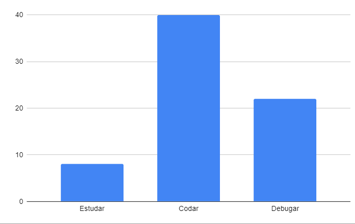

## Restrospectiva sprint 6

### De 11/04 a 17/04

| Data       | Versão | Descrição                                           | Autor              |
| ---------- | ------ | --------------------------------------------------- | ------------------ |
| 21/05/2021 | 1.0    | Transferindo do drive para o gh-pages               |    Helena   Lucas Machado   |

## Quantidade de horas gastas pelos MDS na sprint
Esta métrica é coletada com a intenção de entendermos onde os desenvolvedores estão gastando mais tempo na disciplina afim de ajudá-los. A quantidade de horas gastas por eles é preenchida em uma planilha do drive, que pode ser encontrada [aqui](https://drive.google.com/drive/folders/1qbKIsqlnY7s33jziuN4mZ-z4Dm_bJ7nM?usp=sharing). O gráfico abaixo mostra o resultado final em quantas horas foram gastas para estudar, codar e debugar o código feito.

- Estudar: 8h
- Codar: 40h
- Debugar: 22h

## Action points solicitados para essa semana

| **Action Points** | **Responsáveis** | **Foi resolvido?** |
| ------------- | ------------ | ------------ | 
| Time incentivar uns aos outros na disciplina | Todos | Sim |
| Time incentivar uns aos outros na disciplina | Todos | Sim |
| Não há | - | Sim |
| Grupo se comprometer a interagir mais, tirar mais dúvidas e responder melhor o professor | Todos | Sim |
| EPS mexerem com refatoração na próxima sprint | Helena, Albino, Machado e Fepas | Parcialmente |
| Reunião para revisar os componentes e a estrutura do produto até então | Todos | Sim |
| Refatoração | Helena, Albino | Sim |
| Planejar quais testes serão feitos e quando | Helena, Albino, Machado e Fepas | Não |

## Retrospectiva

| **Pontos fracos** | **Pontos fortes** |
| ------------- | ------------- |
| Faltou refatoração do backend (Helena) | Próxima sprint os EPS poderão focar em testes, que é algo meio urgente (Helena) |
| Commits não estão padronizados (Fepas) | Cristian leu a documentação do projeto (Helena) |
| Más práticas de commit - falta acontecer com mais frequência, revezar quem está codando, etc (Fepas) | Componente que a Duda fez (Lyra, Cristian) |
| Guia de contribuição está incorreto em como colocar o co-authored-by (Helena) | Adaptabilidade da equipe para um novo horário pra reunião é bom (Lyra) |
| Equipe anunciou em cima da hora a ausência na reunião de sábado (Helena-braba) | Refatoração do front foi muito legal (Helena) |
| Pareamento em trio não funcionou bem (foi difícil conciliar horários, a lógica de divisão de commits tbm é complicada) (Cristian, Lyra) | Nosso projeto é simples e fácil de rodar. Parabéns demais!! (Helena) |
| Equipe usa muito o termo de não ter tempo, mas precisamos priorizar a disciplina pra passar nela (Lyra) | Frontend tá bonitão! (Helena) |
| Issues novas sendo feitas em issues de branches passadas (Cristian) | MVP tá aí, vê quem quer (Fepas, Helena) |

## Action points solicitados para próxima semana

| **Action Points** | **Responsáveis** |
| ----------------- | ---------------- |
| Refatorar o backend | Machado, Fepas |
| Equipe passar a ler a documentação do projeto, inclusive o guia de contribuição, e respeitá-lo | Todos |
| Commitar mais vezes, revezar mais quem está commitando, etc | Lyra, Duda, Mari, Rafa, Cristian e Cibele |
| Corrigir o documento de contribuição | Fepas |
| Avisar com antecedência os colegas | Todos. |
| Não repetir essa prática | Machado, Fepas, Helena e Albino |
| Disponibilizar mais tempo pra disciplina que exige mais | Todos |
| Criar nova branch para nova issue, e respeitar as boas práticas de organização do repositório | Todos |

## Quadro geral

|US|Pontos estimados pela equipe|Pontuação entregue|Rastreamento|
|-|-|-|-|
| US1   | 0 (dívida técnica)  | 5 |[frontend #21](https://github.com/parlamentaqui/frontend/issues/21)|
 US3   | 0 (dívida técnica)   | 5|[frontend #23](https://github.com/parlamentaqui/frontend/issues/23)|
| US38  | 0 (dívida técnica) | 13|[gateway #1](https://github.com/parlamentaqui/gateway/issues/122)|
| US39  | 0 (dívida técnica)  | 13|[gateway #13](https://github.com/parlamentaqui/gateway/issues/13)|
|US15| 0 (dívida técnica) |5|[frontend #31](https://github.com/parlamentaqui/frontend/issues/31)|
|US33|5|0|[frontend #45](https://github.com/parlamentaqui/frontend/issues/45)|
|US54|5|0|[gateway #21](https://github.com/parlamentaqui/gateway/issues/21)|
|US56|5|0|[frontend #46](https://github.com/parlamentaqui/frontend/issues/46)|
|TOTAL|15|39|

