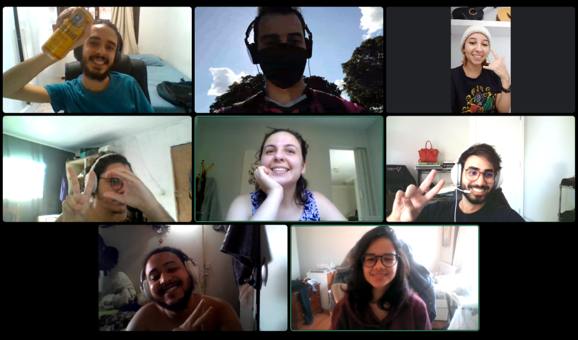
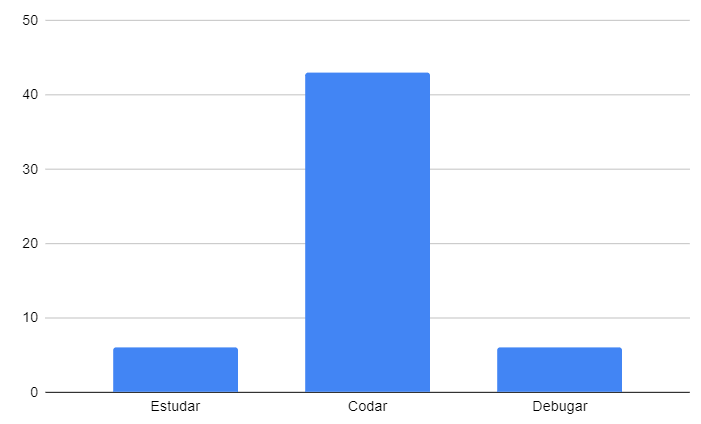

## Restrospectiva sprint 7

### De 18/04 a 24/04

| Data       | Versão | Descrição                                           | Autor              |
| ---------- | ------ | --------------------------------------------------- | ------------------ |
| 21/05/2021 | 1.0    | Transferindo do drive para o gh-pages               |    Helena   Lucas Machado   |

## Quantidade de horas gastas pelos MDS na sprint
Esta métrica é coletada com a intenção de entendermos onde os desenvolvedores estão gastando mais tempo na disciplina afim de ajudá-los. A quantidade de horas gastas por eles é preenchida em uma planilha do drive, que pode ser encontrada [aqui](https://drive.google.com/drive/folders/1qbKIsqlnY7s33jziuN4mZ-z4Dm_bJ7nM?usp=sharing). O gráfico abaixo mostra o resultado final em quantas horas foram gastas para estudar, codar e debugar o código feito.

- Estudar: 8h
- Codar: 40h
- Debugar: 22h

## Action points solicitados para essa semana

| **Action Points** | **Responsáveis** | **Foi resolvido?** |
| ------------- | ------------ | ------------ | 
| Refatorar o backend | Machado, Fepas | Não |
| Equipe passar a ler a documentação do projeto, inclusive o guia de contribuição, e respeitá-lo | Todos | Parcialmente |
| Commitar mais vezes, revezar mais quem está commitando, etc | Lyra, Duda, Mari, Rafa, Cristian e Cibele | Não |
| Corrigir o documento de contribuição | Fepas | sim |
| Avisar com antecedência os colegas | Todos. | sim |
| Não repetir essa prática | Machado, Fepas, Helena e Albino | sim |
| Disponibilizar mais tempo pra disciplina que exige mais | Todos | sim |
| Criar nova branch para nova issue, e respeitar as boas práticas de organização do repositório | Todos | Não |

## Retrospectiva

| **Pontos fracos** | **Pontos fortes** |
| ------------- | ------------- |
| Falta combinar as tasks dos EPS em conjunto (Helena) | Dia de lançar a release de MVP!!! <3  |
| Comunicação dos EPS não tá legal (Helena)  | Lyra fez vídeos mostrando os componentes do back e isso auxiliou muito os colegas (Cibele) |
| Os dois pontos anteriores resultaram na não-refatoração do back (Helena) | Cristian ajudou bastante (Mari, Rafa) |
| Semana corrida e atolada para alguns (Helena, Machado, Fepas, Rafinha, Albino) | MDS mandam dailies bonitinho, direitinho (Helena) |
| A refatoração deu um trabalho a mais na hora de fazer a task (Cristian) | Machado conseguiu mexer com testes, Albino também (Helena) |
| Delay entre pedidos nos PRs + conserto tá mto longo (Albino) | MDS conseguiram se virar sem EPS!!!! (Lyra) |
| Tem coisas subindo quebradas para produção (Fepas) | O nível dos MDS tá começaaaando a nivelar (Albino) |
| Esquecemos (Albino e Helena) de reverter uma alteração momentânea de puxar dados só do front e virou um bug pra geral | Os MDS focaram em resolver as dívidas técnicas deles e isso aliviou um pouco o atraso do MVP (Todos) |
| A release de MVP tá 1 semana atrasada |  |
| Helena e Albino não conseguiram codar em conjunto essa semana |  |

## Action points solicitados para próxima semana

| **Action Points** | **Responsáveis** |
| ----------------- | ---------------- |
| EPS terem 15min pra discutir sobre como sera a próxima semana de cada um  | Machado, Fepas, Helena e Albino |
| Dar o Pull antes de começar a task para evitar conflitos e fadiga | Lyra, Duda, Mari, Rafa, Cristian e Cibele |
| Avisar no grupo quando tivermos mudanças nos PRs  | Machado, Fepas, Helena e Albino |
| Finalizar tarefas e rodar elas antes de abrir o PR | Lyra, Duda, Mari, Rafa, Cristian e Cibele |
| Reverter alterações momentâneas | Todos |
| Correr com o cronograma das próximas sprints para recuperar o tempo perdido  | Albino |

## Quadro geral

|US|Pontos estimados pela equipe |Pontuação entregue|Rastreamento|
|-|-|-|-|
|US34| 0 (dívida técnica) |8|[frontend #34](https://github.com/parlamentaqui/frontend/issues/34)|
|US12|0 (dívida técnica)|3|[frontend #30](https://github.com/parlamentaqui/frontend/issues/30)|
|US16|0 (dívida técnica)|3|[frontend #32](https://github.com/parlamentaqui/frontend/issues/32)|
|US31|0 (dívida técnica)|13|[frontend #33](https://github.com/parlamentaqui/frontend/issues/33)|
|US54|0 (dívida técnica)|5|https://github.com/parlamentaqui/gateway/issues/21|
|US56|0 (dívida técnica)|5|https://github.com/parlamentaqui/frontend/issues/46|
|US07|13|0|https://github.com/parlamentaqui/frontend/issues/61|
|US10|5|0|https://github.com/parlamentaqui/frontend/issues/59|
|US19|13|0|https://github.com/parlamentaqui/frontend/issues/60|
|Total|31|40|

